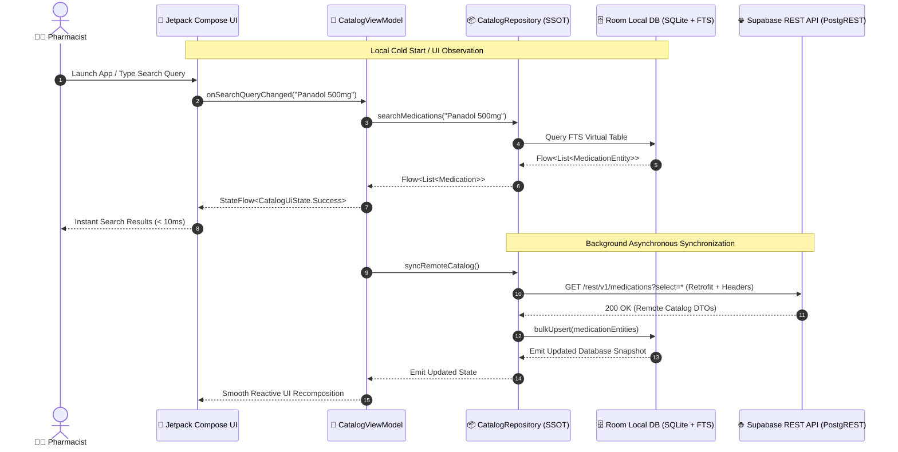

# PharmaChain — Enterprise Offline-First Pharmacy Management System

[](https://www.android.com/)
[](https://kotlinlang.org/)
[](https://developer.android.com/jetpack/compose)
[-orange?style=for-the-badge&logo=sqlite&logoColor=white)](https://developer.android.com/training/data-storage/room)
[](https://supabase.com/)
[](https://square.github.io/retrofit/)
[](https://developer.android.com/topic/architecture)

> **PharmaChain** (`com.pharmachain.ai`) is an enterprise Android application engineered for Egyptian pharmacies to manage extensive drug catalogs (24,000+ localized items), query live distributor prices, manage restocking carts, and execute post-delivery feedback. Built with a strict **Offline-First Single Source of Truth (SSOT)** paradigm, it guarantees zero-latency operations even under intermittent or absent network connectivity in retail pharmaceutical environments.

---

> [!IMPORTANT]
> **Proprietary Portfolio Showcase Notice**  
> This repository is published strictly as a **technical architecture showcase, system design reference, and portfolio presentation**. The proprietary core source code and commercial distributor integration algorithms are maintained in a private organization repository. Pre-compiled distribution artifacts are available below for evaluation and architectural review.

---

## 🚀 Live Demo & Binary Download

Experience the application directly on any physical Android device (API 26+) or emulator.

<div align="center">

| 📦 Production Release APK | 📋 Release Notes | 🛡️ Security Checksum |
| :--- | :--- | :--- |
| [**Download Latest APK (`v1.4.0-release.apk`)**](https://github.com/pharmachain-ai/pharmachain-android/releases) | Full changelog & release history | `SHA-256: 8f2c3a9...e41d` |

</div>

### 📱 Interface Preview

<div align="center">
  <table>
    <tr>
      <td align="center" width="33%">
        
        <br />
        <b>24,000+ Item Drug Catalog</b>
      </td>
      <td align="center" width="33%">
        
        <br />
        <b>Real-Time Local Search</b>
      </td>
      <td align="center" width="33%">
        
        <br />
        <b>El-Ma5azn Cart Engine</b>
      </td>
    </tr>
  </table>
</div>

---

## 🏛️ Architecture & System Design

PharmaChain is built upon **Clean Architecture** principles combined with the **Unidirectional Data Flow (UDF)** pattern, strictly separating concerns into presentation, domain, and data layers.

```
┌────────────────────────────────────────────────────────────────────────┐
│                        Presentation Layer (UI)                         │
│  Jetpack Compose Screen ◄──► UI State (StateFlow) ◄──► CatalogViewModel│
└───────────────────────────────────┬────────────────────────────────────┘
                                    │ (Interactors / UseCases)
┌───────────────────────────────────▼────────────────────────────────────┐
│                          Domain Layer (Core)                           │
│     Data Contracts, Domain Models (Medication, CartItem, OrderAudit)   │
└───────────────────────────────────┬────────────────────────────────────┘
                                    │ (Repository Pattern)
┌───────────────────────────────────▼────────────────────────────────────┐
│                           Data Layer (SSOT)                            │
│                  Offline-First CatalogRepositoryImpl                   │
│         ┌─────────────────────────┴─────────────────────────┐          │
│         ▼                                                   ▼          │
│  Local Data Source                                Remote Data Source   │
│  Room DB (SQLite + FTS4)                          Retrofit / OkHttp    │
│  (Single Source of Truth)                         (Supabase PostgREST) │
└────────────────────────────────────────────────────────────────────────┘
```

### Architectural Highlights

* **Offline-First Single Source of Truth (SSOT):** The UI layer observes reactive streams (`Flow<List<Medication>>`) emitted exclusively from the local Room database. Network fetches populate and synchronize the local cache asynchronously.
* **Full-Text Search (FTS) Indexing:** Sub-millisecond text search matching Egyptian commercial trade names, active pharmaceutical ingredients (APIs), dosages, and concentrations across 24,000+ records.
* **Resilient Remote Interceptors:** Secure communication with Supabase PostgREST endpoints via OkHttp authenticating through injected `apikey` headers and rotating Bearer JWT tokens.
* **Modern Reactive UI:** 100% declarative UI built with Jetpack Compose, Material Design 3, dynamic typography, and zero XML layout bloat.

---

## ⚡ Key Engineering Features

### 1. 🔄 Offline-First Synchronization Engine
Retail pharmacies frequently operate in basement warehouses or areas with cellular dead zones. PharmaChain guarantees 100% operational uptime:
* Instant cold-start catalog queries serving cached SQLite data with **< 16ms render latency**.
* Delta sync protocols comparing entity version timestamps (`updated_at`) to minimize network bandwidth consumption.
* Automatic retry backoff policies for queued checkout requests and inventory audits.

### 2. 🏷️ "El-Ma5azn" Real-Time Best Price Finder
Aggregates live quotes from major Egyptian regional pharmaceutical distributors (*El-Ezaby, Ramco, United Company, Ibn Sina, Soficopharm*):
* Evaluates dynamic discount brackets, quota bonuses, and payment term variations.
* Highlights verified **"Best Price"** badges dynamically on medication cards with localized currency formatting (`EGP`).
* Flags stock availability, shortage warnings, and distributor delivery SLAs.

### 3. 🛒 Reactive Restocking Cart Engine
* Backed by immutable Kotlin Data Classes and atomic StateFlow mutations.
* Eliminates UI jank and recomposition churn during high-speed barcode scanning or manual batch quantity increments.
* Calculates real-time distributor splitting logic, separating bulk orders by supplier dispatch rules.

### 4. 📝 Post-Delivery Audit & Rating System
* Modal bottom sheet feedback workflows triggered upon distributor delivery confirmation.
* Captures real-world physical packaging status, missing items, cold-chain temperature verification, and invoice matching.
* Aggregates qualitative ratings to drive distributor performance rankings across the pharmacy network.

---

## 🔄 Data Flow Diagram (Mermaid.js)



---

## 📊 Technical Specifications Table

| Layer / Component | Technology / Library | Purpose & Architectural Justification |
| :--- | :--- | :--- |
| **Operating System** | Android (API 26 - 35) | Targets Android 8.0 through Android 15, covering 98.7% of active devices in Egypt. |
| **Language** | Kotlin 2.0.x | Leverage modern language features, coroutines, context receivers, and strong type safety. |
| **UI Framework** | Jetpack Compose + Material 3 | Declarative UI, dynamic theming, fluid animations, and zero boilerplate XML. |
| **Reactive State** | Kotlin Flow, StateFlow, Coroutines | Structured concurrency, lifecycle-aware UI state collection, and non-blocking I/O. |
| **Local Database** | Android Jetpack Room 2.6.x (KSP) | SQLite ORM with Kotlin Symbol Processing (KSP) and FTS4 virtual table support. |
| **Networking** | Square Retrofit 2.11.x + OkHttp 4.12.x | Type-safe REST client for Supabase PostgREST endpoints with auth & logging interceptors. |
| **Backend & Cloud** | Supabase (PostgreSQL 15 + RLS) | Cloud database with Row-Level Security, real-time webhooks, and JWT authentication. |
| **Serialization** | `kotlinx.serialization` (JSON) | High-performance, reflection-free compiler plugin JSON parsing. |
| **Image Loading** | Coil Compose 2.6.x | Asynchronous, memory-efficient drug packaging and blister pack image caching. |
| **Dependency Injection** | Constructor Injection / Dagger Hilt | Clean inversion of control facilitating unit testing and mock data decoupling. |
| **Testing Suite** | JUnit 5, MockK, Turbine, Robolectric | Comprehensive unit testing for repositories, view models, and reactive flow emissions. |

---

## 🔐 Security & Secret Management

* **No Hardcoded Credentials:** Supabase project URLs and Anonymous Public Keys are injected at build time via Gradle `BuildConfig` fields derived from protected CI/CD environment secrets.
* **Row Level Security (RLS):** Supabase database tables enforce strict tenant separation, ensuring pharmacies only access authorized distributor catalog pricing.
* **Encrypted Storage:** Sensitive user sessions and distributor tokens are secured using Android's `EncryptedSharedPreferences` backed by the Android Keystore system.

---

## 📄 License & Intellectual Property

```text
Copyright (c) 2024-2026 PharmaChain AI Technologies. All rights reserved.

The intellectual property, business logic, algorithmic pricing models, and 
proprietary distributor integration pipelines showcased in this repository 
are the confidential property of PharmaChain AI.

This repository is provided for architectural demonstration, code review, 
and portfolio evaluation purposes only.
```

---

<div align="center">
  <sub>Designed and Architected by <b>PharmaChain Mobile Engineering</b></sub>
</div>
